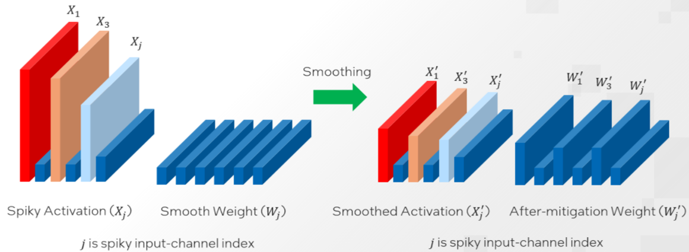

# Smooth Quant

1. [Introduction](#Introduction)

2. [Quantization Fundamentals](#Quantization-Fundamentals)
3. [SmoothQuant](#SmoothQuant)
4. [SmoothQuant Support Matrix](#SmoothQuant-Support-Matrix)
5. [Validated Models](#Validated-Models)
6. [Example](#Example)

## Introduction

Quantization is a common compression operation to reduce memory and accelerate inference by converting the floating point matrix to an integer matrix. For large language models (LLMs) with gigantic parameters, the systematic outliers make quantification of activations difficult.  [SmoothQuant](https://arxiv.org/abs/2211.10438), an training free post-training quantization (PTQ) solution, offline migrate this difficulty from activations to weights with a mathematically equivalent transformation.

## Quantization Fundamentals

Quantization convert the floating point matrix to an integer matrix.  `Affine quantization` and `Scale quantization`, also called `asymmetric quantization` and `symmetric quantization`, are two common range mapping techniques used in tensor conversion between different data types.

For more details, please read [quantization](quantization.md).
## SmoothQuant

Some models, especially LLMs, activations are much harder to quantize due to the outliers than weights which the distribution is uniform and flat. The variance amongst the channels for a given token is large but small between magnitudes of a given channels, therefore, the quantization error will decrease if we can use activation per-channel quantization. However, can't perform channel-wise activation quantization currently because it cannot map to hardware-accelerate GEMM kernels well.

SmoothQuant is an alternative method of per-channel activation quantization. It divide the input activation by a per-channel smoothing factor $s\in\mathbb R^{C_i} $ , where $C_i$ is the input channel. Also scale the weights accordingly to keep the mathematical equivalence.
$$
Y = (Xdiag(s)^{-1})\cdot(diag(s)W) = \hat{X}\hat{W}
$$
This formula migrate the difficulty from activations to weights. In order to control how much difficulty shift to weights, we use a hyper-parameter named migration strength $\alpha$. 
$$
s_j = max(|X_j|)^\alpha / max(|W_j|)^{1-\alpha}
$$
$j = 1, 2, ...s, C_i$ where j correspond to j-th input channel.

For most of models, such as OPT and BLOOM, $\alpha = 0.5$ which means balance the difficult between activations and weights, can have a low quantization error. For others models with more significant outliers in activations, increase $\alpha$ to a bigger num, for example 0.75 ,  to migrate more quantization difficulty to weights.

## SmoothQuant Support Matrix

| **Algorithm** | **PyTorch** | **TensorFlow** |
| ------------- | ----------- | -------------- |
| SmoothQuant   | ✔           | ✖              |

## Validated Models

| Model\Accuracy        | FP32   | INT8 (w/o SmoothQuant) | INT8 (w/ SmoothQuant) |
| --------------------- | ------ | ---------------------- | --------------------- |
| bigscience/bloom-560m | 65.16% | 64.96%                 | 66.52% (alpha=0.5)    |
| bigscience/bloom-1b7  | 71.55% | 67.61%                 | 72.81% (alpha=0.5)    |
| bigscience/bloom-3b   | 74.06% | 70.73%                 | 74.41% (alpha=0.5)    |
| bigscience/bloom-7b1  | 77.59% | 76.28%                 | 77.18% (alpha=0.5)    |
| bigscience/bloom-176b | 84.17% | 82.13%                 | 83.52% (alpha=0.6)    |
| facebook/opt-125m     | 63.89% | 63.54%                 | 63.91% (alpha=0.5)    |
| facebook/opt-2.7b     | 77.90% | 78.99%                 | 78.91% (alpha=0.5)    |
| facebook/opt-6.7b     | 81.51% | 79.44%                 | 81.58% (alpha=0.5)    |
| EleutherAI/gpt-j-6B   | 79.17% | 78.76%                 | 79.13% (alpha=0.5)    |

## Example

User could refer to [examples](https://github.com/intel/neural-compressor/blob/master/examples/pytorch/nlp/huggingface_models/language-modeling/quantization/ptq_static/ipex/smooth_quant/README.md) on how to use smooth quant.